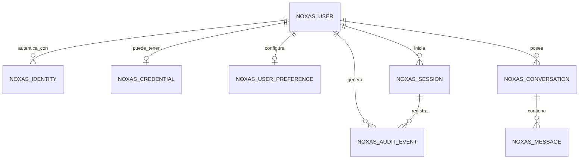

# Modelo de usuarios y conversaciones de NOXAS

Este modelo separa autenticación, perfiles, conversaciones y sesiones. La primera versión se prueba en Oracle Database dentro de VirtualBox. La base productiva podrá migrarse más adelante sin exponer Oracle directamente a Internet ni exigir que la HP permanezca encendida.

## Principios

1. **Una cuenta puede tener varias identidades.** Un mismo usuario podrá iniciar sesión con contraseña local, Google, Microsoft o GitHub sin duplicar sus conversaciones.
2. **Las contraseñas nunca se guardan en texto plano.** `noxas_credential` almacena solamente un hash generado por el backend.
3. **Los tokens de sesión tampoco se guardan completos.** `noxas_session` conserva un hash revocable del token de renovación.
4. **Cada conversación pertenece a un usuario.** Los mensajes no se consultan sin validar primero esa relación.
5. **Los borrados funcionales usan estado.** Una conversación puede archivarse o marcarse como eliminada antes del borrado físico.
6. **Las métricas del modelo son opcionales.** Tokens, latencia y proveedor sirven para controlar costos y rendimiento, pero no bloquean el guardado del mensaje.
7. **El historial local actual puede migrarse.** Cada conversación guardada en `localStorage` podrá enviarse al backend cuando el usuario inicie sesión y acepte sincronizarla.

## Relaciones



## Tablas principales

### `noxas_user`

Cuenta lógica de la aplicación. Contiene correo, nombre visible, estado y fechas de acceso.

No contiene:

- contraseña;
- tokens;
- claves de proveedores externos;
- historial completo.

### `noxas_identity`

Relaciona la cuenta con uno o más métodos de autenticación:

- `LOCAL`;
- `GOOGLE`;
- `MICROSOFT`;
- `GITHUB`;
- `MAGIC_LINK`.

La combinación `provider_code + provider_subject` es única.

### `noxas_credential`

Existe únicamente para cuentas con contraseña local. El backend debe generar un hash moderno, preferentemente Argon2id, y aplicar límites de intentos. El navegador jamás escribe directamente en esta tabla.

### `noxas_session`

Permite sesiones revocables entre dispositivos. Cada inicio de sesión crea una sesión independiente, lo que permitirá mostrar más adelante:

- Android de Facu;
- navegador de la HP;
- iPhone o iPad;
- fecha de última actividad;
- opción de cerrar una sesión remota.

### `noxas_conversation`

Cabecera del chat. Guarda título, estado, modelo, perfil del sistema, resumen opcional y fecha del último mensaje.

El resumen se utilizará para reducir el contexto enviado al modelo cuando una conversación sea larga. No sustituye los mensajes originales.

### `noxas_message`

Guarda cada mensaje en orden mediante `sequence_no`. También permite registrar:

- rol;
- estado;
- modelo y proveedor;
- esfuerzo de razonamiento;
- tokens de entrada y salida;
- latencia;
- código de error;
- metadatos técnicos.

`client_message_id` evita duplicados si el celular reintenta una solicitud por mala conexión.

### `noxas_audit_event`

Registra eventos de seguridad, por ejemplo:

- login correcto o fallido;
- cambio de contraseña;
- revocación de sesión;
- exportación o eliminación de conversaciones;
- acceso denegado.

No debe almacenar contraseñas, tokens completos, consultas sensibles ni direcciones IP en texto plano.

## Flujo de guardado

```text
1. El usuario envía un mensaje.
2. El backend valida sesión y propiedad de la conversación.
3. Inserta el mensaje USER con estado COMPLETED.
4. Llama a la IA.
5. Inserta el mensaje ASSISTANT con contenido y métricas.
6. Actualiza last_message_at y updated_at de la conversación.
7. Devuelve la respuesta al navegador.
```

Si la IA falla, el mensaje del usuario permanece guardado y se registra un mensaje o evento con estado `ERROR`. Esto permite reintentar sin fingir que nada ocurrió, una costumbre bastante popular en interfaces menos cuidadas.

## Estrategia local y productiva

### Laboratorio en VirtualBox

- Oracle Database 23c/23ai Free.
- Datos ficticios o personales de prueba.
- Scripts SQL versionados en Git.
- Backend accesible sólo desde la red local.
- Copias del archivo de datos no se suben al repositorio.

### Producción futura

- Base administrada en la nube.
- Acceso exclusivo desde funciones/backend.
- Conexiones cifradas.
- Secretos almacenados fuera de React y GitHub.
- Migraciones ejecutadas con una cuenta técnica limitada.

## Orden de implementación

1. Ejecutar `001_core_schema.sql` en la VM.
2. Insertar un usuario de desarrollo sin datos reales.
3. Crear endpoints locales para conversaciones y mensajes.
4. Reemplazar `localStorage` por sincronización opcional.
5. Incorporar login personal.
6. Agregar proveedores externos.
7. Elegir y migrar a la base productiva.

## Decisiones pendientes

- Proveedor de identidad para producción.
- Política de retención y borrado.
- Cifrado adicional para contenido sensible.
- Exportación de conversaciones.
- Límite de almacenamiento por usuario.
- Base cloud definitiva.
